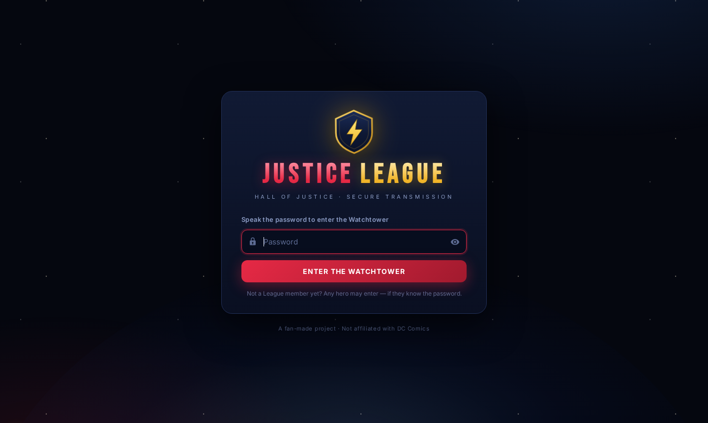
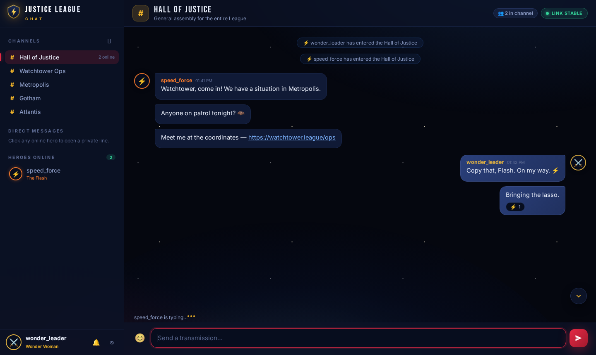
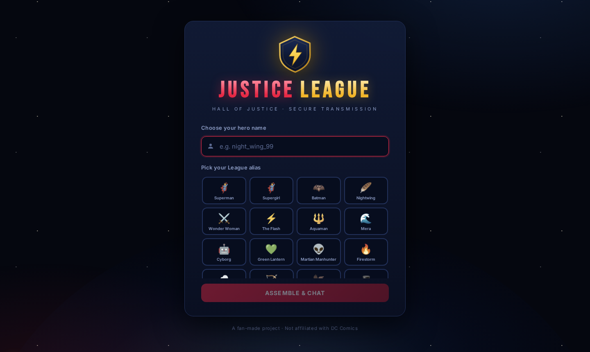
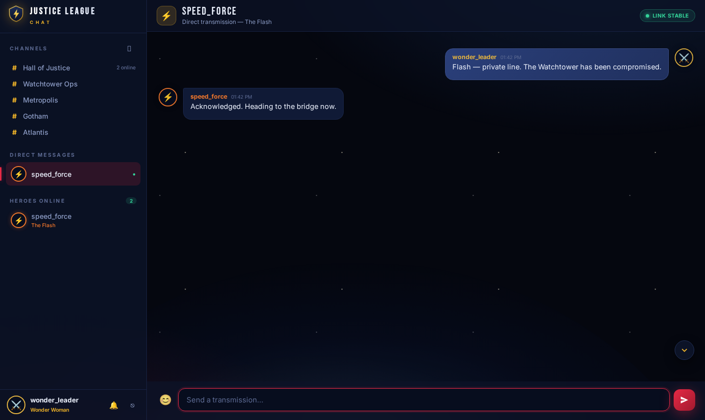
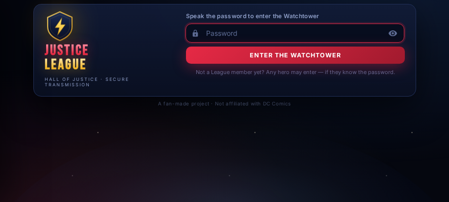
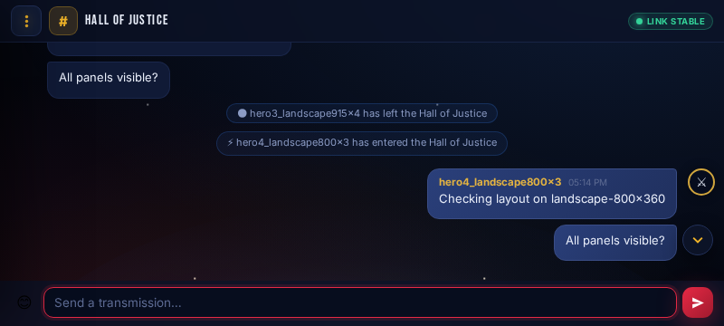
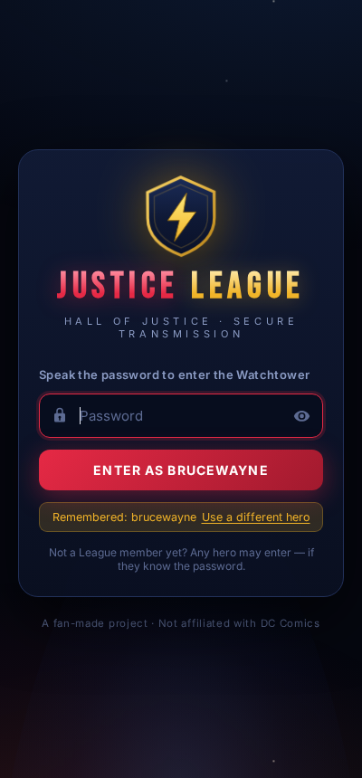

<div align="center">

# 🛡️ Justice League Chat

**A cinematic, real-time Watchtower chat. Speak the password, pick your hero, and join the League.**

[](https://nodejs.org)
[](https://socket.io)
[](LICENSE)












*A fan-made project — not affiliated with DC Comics.*

</div>

---

## ⚡ Features

### Getting in
- **Password gate** — the password is asked on **every visit** (nothing is auto-logged-in)
- **Remembered hero** — your hero name and alias are remembered, so a return visit is just the password and one tap: *"Enter as brucewayne"* · *use a different hero* to switch
- **Hero identity** — 16 League aliases (Superman, Batman, Wonder Woman, The Flash, Aquaman, Cyborg, and more), each with a color-coded avatar
- **Reconnect-safe** — signing in again with the same hero (a phone reload, say) takes over your old connection instead of being turned away

### Talking
- **History that lasts 3 days** — messages are written to disk and kept for a rolling 3-day window (configurable), so they survive server restarts; day dividers group them by Today / Yesterday / date
- **Group channels** — five themed channels by default (Hall of Justice, Watchtower Ops, Metropolis, Gotham, Atlantis) and anyone can open new ones
- **Direct messages** — click any online hero for a private 1:1 line
- **Emoji reactions** — hover any message and hit ⚡ 💥 🛡️ ❤️ 😂 👍
- **Delete your own messages** — gone for everyone, shown as *“transmission deleted”*
- **Smart message grouping** — consecutive messages from the same hero collapse into a block, with day dividers and auto-linkified URLs
- **Typing indicators** — per channel and per DM, multi-user aware
- **Live presence** — who's online, who's in the channel, join/leave announcements in the Hall
- **Unread badges** — sidebar badges, tab-title counter and a jump-to-latest button
- **Sound notifications** — a soft ping for new messages, with a mute toggle

### Under the hood
- **Reconnect-safe sessions** — session tokens rotate on every connection, so a flaky Wi-Fi never logs you out
- **Rate limiting** — a token bucket keeps speedsters from flooding the Hall
- **XSS-safe rendering** — all message text is rendered through text nodes; nothing is ever `innerHTML`-ed from user input
- **Fits every phone** — dedicated layouts for portrait *and* landscape (the drawer, compact header and two-column login respond to viewport **height** as well as width), safe-area insets for notches, and dynamic viewport height so Android browser chrome never clips the composer
- **Connection status** — a live "Link stable / Reconnecting…" pill

## 🚀 Quick start

Requires [Node.js](https://nodejs.org) 18 or newer.

```bash
git clone https://github.com/ansh94967-sudo/justice-league-chat.git
cd justice-league-chat
npm install
npm start
```

Open **http://localhost:3000** and enter the default password:

```
watchtower
```

> Open the app in two browser windows with different hero names to try the chat.

## 🔧 Configuration

| Environment variable | Default    | Description                          |
| -------------------- | ---------- | ------------------------------------ |
| `SITE_PASSWORD`      | `watchtower` | The password everyone must enter    |
| `PORT`               | `3000`     | Port the server listens on           |
| `HISTORY_DAYS`       | `3`        | Days of message history to keep      |
| `DATA_DIR`           | `./data`   | Where `history.json` is written      |

```bash
# Linux / macOS
SITE_PASSWORD="my-secret" PORT=8080 npm start

# Windows (PowerShell)
$env:SITE_PASSWORD="my-secret"; npm start
```

## ✅ Testing

```bash
npm test              # 27 integration tests: gate, rooms, DMs, reactions, deletion,
                      # rate limiting, session renewal, re-login takeover, history
node test-store.js    # 20 unit tests for the store: retention window, persistence, corruption
node login-qa.js      # optional: drives the real login flow in a headless browser
node visual-qa.js     # optional: headless-browser visual QA + screenshots (needs puppeteer-core)
node responsive-qa.js # optional: checks nothing is clipped on 6 phone sizes
                      # (portrait + landscape) and writes screenshots to docs/responsive/
```

## ☁️ Deployment

Any Node host works — [Render](https://render.com), [Railway](https://railway.app), [Fly.io](https://fly.io), or your own VPS.

- **Build command:** `npm install`
- **Start command:** `npm start`
- Set `SITE_PASSWORD` in the host's environment variables
- WebSocket support is built in (Socket.IO) — no extra config on the hosts above

## 📜 Project structure

```
├── server.js              # Express + Socket.IO backend
├── store.js               # persistent history + 3-day retention window
├── test-integration.js    # end-to-end integration tests
├── test-store.js          # store unit tests
├── login-qa.js            # headless test of the login/return flow
├── visual-qa.js           # headless-browser visual QA & screenshots
├── responsive-qa.js       # phone-size clipping checks
├── docs/                  # screenshots used in this README
└── public/
    ├── index.html         # gate + chat markup
    ├── style.css          # Watchtower theme (starfield, glass, glow)
    ├── app.js             # all client logic
    └── favicon.svg        # the shield
```

## ⚠️ Notes & roadmap

- **History is persisted to disk** (`data/history.json`) and pruned to the last `HISTORY_DAYS` days (default 3). Sessions and presence are still in-memory and reset on restart — which is what you want, since everyone re-enters the password anyway.
- **On hosts with an ephemeral filesystem** (e.g. a Render web service without a disk), the history file survives process restarts but **not redeploys**. To keep it, add a persistent disk mounted at `/data` and set `DATA_DIR=/data`.
- The password gate is a shared passphrase, not per-user authentication — fine for a fun project, not for secrets.
- Ideas: private channels, message search, per-hero themes, image sharing, translation relay.

## 🛡️ License

[MIT](LICENSE) — © 2026 Ansh Singh
